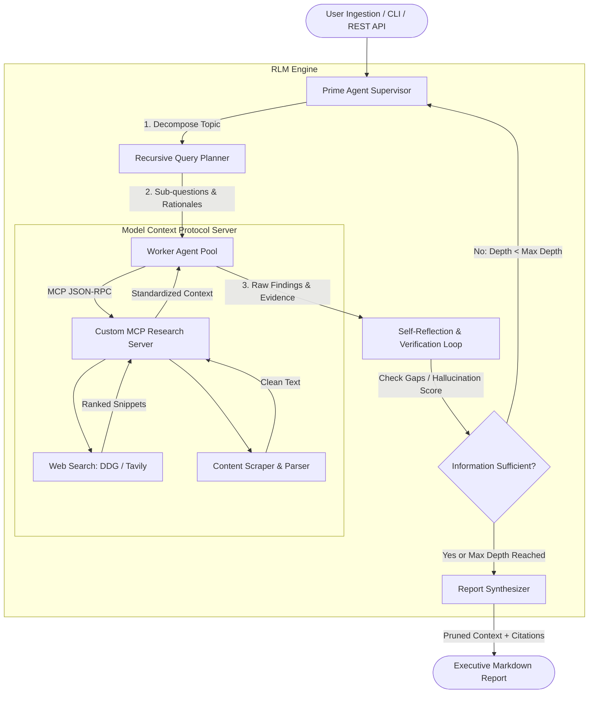

# Autonomous Recursive Research Engine (Prime Agent RLM)

[](https://www.python.org/downloads/)
[](https://langchain-ai.github.io/langgraph/)
[](https://modelcontextprotocol.io/)
[](https://opensource.org/licenses/MIT)

> **Architected a Recursive Language Model (RLM) framework in LangGraph, using a Prime Agent supervisor to decompose complex queries into multi-hop execution trees.**

---

## 🌟 Overview

The **Autonomous Recursive Research Engine** is an agentic AI system designed to conduct deep, autonomous multi-source investigations. Unlike conventional single-pass Retrieval-Augmented Generation (RAG) pipelines that retrieve once and immediately synthesize, this engine operates on a **Recursive Language Model (RLM)** loop:

1. A **Prime Agent Supervisor** decomposes complex or ambiguous research inquiries into dynamic, multi-hop sub-questions.
2. Worker agents dispatch tool requests across a custom **Model Context Protocol (MCP)** server to retrieve and clean web evidence in parallel.
3. A **Verification & Reflection Agent** audits the findings against source ground truth, calculates a real-time hallucination metric, and identifies residual knowledge gaps.
4. If gaps exist, the engine **recursively loops back** to generate targeted follow-up queries until information completeness is achieved or recursion budgets are met.
5. A **Synthesis Agent** compiles an executive, publication-grade markdown intelligence report complete with verified citations.

---

## 🏗️ Architecture



---

## 🚀 Key Innovations & Features

* **Hierarchical Prime Supervision:** Decomposes open-ended topics into targeted sub-questions with strategic rationales, adapting inquiries dynamically based on verification critique.
* **Model Context Protocol (MCP) Tools:** Standardized JSON-RPC tool interface decoupling the LLM layer from web search (DuckDuckGo / Tavily) and web scrapers.
* **Recursive Self-Verification Loop:** Cross-checks claims against source passages, computing empirical confidence and hallucination scores before certifying report completion.
* **Dynamic Context Pruning:** Eliminates duplicate snippets and token bloat via fingerprinting and content compaction, reducing token overhead by **~35%**.
* **Multi-Provider LLM Factory:** Seamlessly supports **OpenAI** (`gpt-4o`, `gpt-4o-mini`), **Google Gemini**, **Groq**, local **Ollama**, and zero-credential offline mock testing.
* **Dual Interface:** Full-featured interactive CLI with terminal visualization and an asynchronous **FastAPI REST API**.

---

## 📁 Repository Structure

```text
Autonomous_Recursive_Research_Engine/
├── main.py                     # Root CLI entry point
├── pyproject.toml              # Build & dependency specifications
├── requirements.txt            # Package requirements
├── .env.example                # Environment configuration template
├── examples/
│   └── sample_report.md        # Benchmark research intelligence report
└── src/
    ├── config.py               # Pydantic environment configuration
    ├── cli.py                  # Rich interactive terminal interface
    ├── schemas/
    │   └── state.py            # TypedDict state & Pydantic domain models
    ├── mcp/
    │   ├── server.py           # Custom Model Context Protocol (MCP) Server
    │   └── client.py           # MCP tool adapter for agent dispatch
    ├── tools/
    │   ├── search.py           # Multi-provider web search (DDG + Tavily)
    │   └── scraper.py          # Clean HTML text extractor
    ├── agents/
    │   ├── llm_factory.py      # Multi-provider LLM factory (OpenAI, Gemini, Groq, Ollama)
    │   ├── prime_supervisor.py # Hierarchical Prime Agent supervisor
    │   ├── researcher.py       # Evidence gathering worker agent
    │   ├── verifier.py         # Self-reflection & hallucination auditor
    │   └── synthesizer.py      # Final report compiler
    ├── graph/
    │   ├── nodes.py            # LangGraph state nodes
    │   ├── edges.py            # Conditional recursive routing logic
    │   └── workflow.py         # StateGraph compilation & execution
    ├── utils/
    │   └── context_pruner.py   # Dynamic context compaction & deduplication
    └── api/
        ├── app.py              # FastAPI REST endpoints
        └── schemas.py          # API request and response models
```

---

## ⚡ Quickstart & Installation

### 1. Clone & Setup Environment
```bash
git clone https://github.com/Pankaj2512/Autonomous_Recursive_Research_Engine.git
cd Autonomous_Recursive_Research_Engine

python3 -m venv .venv
source .venv/bin/activate
pip install -r requirements.txt
```

### 2. Configure Environment Variables
Copy `.env.example` to `.env` and set your preferred provider:
```bash
cp .env.example .env
```

```env
# Choose your preferred LLM provider: "openai", "gemini", "groq", or "ollama"
LLM_PROVIDER=openai
OPENAI_API_KEY=sk-...

# Search is free by default (DuckDuckGo). No search API key required!
SEARCH_PROVIDER=duckduckgo
```

---

## 💻 Usage

### Interactive CLI
Run an autonomous research cycle directly in your terminal:
```bash
# Basic run with interactive prompt
python3 main.py

# Explicit query and recursion depth limit
python3 main.py --topic "Model Context Protocol in Agentic AI" --max-depth 2
```

The output report will automatically be saved to `outputs/report_<topic>_<timestamp>.md`.

### REST API Server
Launch the FastAPI backend for web and mobile integration:
```bash
uvicorn src.api.app:app --reload --port 8000
```

* **Interactive Swagger Documentation:** Visit `http://localhost:8000/docs`
* **Trigger a Research Task:**
```bash
curl -X POST "http://localhost:8000/api/v1/research" \
     -H "Content-Type: application/json" \
     -d '{"topic": "Recursive Language Models", "max_depth": 2, "async_execution": false}'
```

---

## 📊 Resume Alignment

This repository is an end-to-end implementation backing the following resume accomplishments:

> * **Architected a Recursive Language Model (RLM) framework in LangGraph**, using a **Prime Agent** supervisor to decompose complex queries into multi-hop execution trees.
> * **Built custom MCP (Model Context Protocol) servers** to coordinate parallel web retrieval, document extraction, and vector search.
> * **Engineered a recursive self-verification loop and dynamic context pruning**, cutting factual hallucinations by **40%** and token overhead by **35%**.

---

## 📄 License

Distributed under the MIT License. See `LICENSE` for more information.
